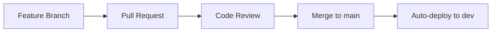
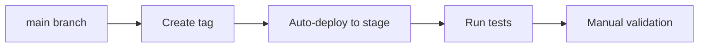
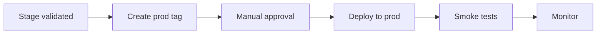
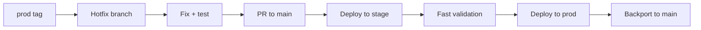

# Release Flow Documentation

## Overview

This document describes the release process for deploying the Unifocus application across multiple environments (dev → stage → prod) with proper approvals and quality gates.

## Environments

### Development (dev)

- **Purpose**: Active development and testing
- **Deployments**: Automatic on push to `main` branch
- **Infrastructure**: Minimal resources for cost efficiency
- **Data**: Test data only
- **URL**: `https://dev.unifocus.example.com` (or CloudFront URL)
- **API**: `https://dev-api.unifocus.example.com` (or ALB URL)

### Staging (stage)

- **Purpose**: Pre-production validation and UAT
- **Deployments**: Automatic on git tags matching `v*-stage` (e.g., `v1.2.3-stage`)
- **Infrastructure**: Production-like resources
- **Data**: Anonymized production data or realistic test data
- **URL**: `https://stage.unifocus.example.com`
- **API**: `https://stage-api.unifocus.example.com`

### Production (prod)

- **Purpose**: Live production environment
- **Deployments**: Manual approval required after stage validation
- **Infrastructure**: Full production resources with HA, auto-scaling, backups
- **Data**: Real customer data
- **URL**: `https://app.unifocus.example.com`
- **API**: `https://api.unifocus.example.com`

## Release Process

### 1. Development Phase



**Steps**:

1. Create feature branch from `main`
2. Develop and test locally
3. Create pull request with description and tests
4. Code review and approval (minimum 1 reviewer)
5. Merge to `main`
6. GitHub Actions automatically deploys to dev environment
7. Verify deployment in dev

**Commands**:

```bash
# Create feature branch
git checkout -b feature/my-feature

# Make changes, commit, push
git add .
git commit -m "feat: add new feature"
git push origin feature/my-feature

# Create PR via GitHub UI or CLI
gh pr create --title "Add new feature" --body "Description"

# After approval, merge
gh pr merge --squash
```

### 2. Stage Deployment



**Steps**:

1. Verify dev deployment is stable
2. Create a release tag for stage
3. GitHub Actions deploys to stage automatically
4. Run automated integration tests
5. Perform manual UAT (User Acceptance Testing)
6. Verify monitoring and logs

**Commands**:

```bash
# Create stage tag
git checkout main
git pull origin main
git tag -a v1.2.3-stage -m "Release v1.2.3 to stage"
git push origin v1.2.3-stage

# Monitor deployment
gh workflow view deploy-api-stage
gh workflow view deploy-web-stage

# Check deployment status
aws ecs describe-services --cluster unifocus-stage-cluster \
  --services unifocus-stage-api-service \
  --query 'services[0].deployments'
```

**Validation Checklist**:

- [ ] All API endpoints responding correctly
- [ ] Web application loads without errors
- [ ] Database migrations applied successfully
- [ ] Authentication/authorization working
- [ ] Critical user flows tested
- [ ] Performance metrics acceptable
- [ ] No error spikes in logs
- [ ] CloudWatch alarms not triggered

### 3. Production Deployment



**Steps**:

1. Complete stage validation checklist
2. Create production release tag
3. Review deployment plan
4. Obtain stakeholder approval
5. Trigger production deployment (manual approval in GitHub Actions)
6. Run smoke tests
7. Monitor for 1 hour
8. Update release notes

**Commands**:

```bash
# Create production tag
git checkout main
git pull origin main
git tag -a v1.2.3 -m "Release v1.2.3 to production"
git push origin v1.2.3

# This triggers the workflow but requires manual approval
# Go to GitHub Actions UI to approve the deployment

# After deployment, verify
aws ecs describe-services --cluster unifocus-prod-cluster \
  --services unifocus-prod-api-service

# Monitor logs
aws logs tail /ecs/unifocus-prod-api --follow

# Check CloudWatch alarms
aws cloudwatch describe-alarms --state-value ALARM
```

**Production Deployment Checklist**:

- [ ] Stage environment validated
- [ ] Stakeholder approval obtained
- [ ] Database backup verified
- [ ] Rollback plan documented
- [ ] On-call engineer available
- [ ] Deployment window scheduled
- [ ] Communication sent to team
- [ ] Feature flags configured (if applicable)

**Post-Deployment Checklist**:

- [ ] All services healthy
- [ ] Smoke tests passing
- [ ] No error rate increase
- [ ] Response times normal
- [ ] Database connections stable
- [ ] No CloudWatch alarms
- [ ] User reports monitored
- [ ] Release notes published

### 4. Hotfix Process

For critical production issues requiring immediate deployment:



**Steps**:

1. Create hotfix branch from production tag
2. Implement minimal fix
3. Test locally and in dev
4. Create PR for review
5. Deploy to stage for quick validation
6. Get emergency approval
7. Deploy to production
8. Backport fix to main branch

**Commands**:

```bash
# Create hotfix branch from production tag
git checkout -b hotfix/critical-fix v1.2.3
git push origin hotfix/critical-fix

# Make fix, commit
git add .
git commit -m "fix: critical issue description"
git push origin hotfix/critical-fix

# Create PR
gh pr create --base main --title "Hotfix: Critical issue"

# After approval, tag for stage
git tag -a v1.2.4-stage -m "Hotfix v1.2.4 to stage"
git push origin v1.2.4-stage

# Validate in stage, then tag for prod
git tag -a v1.2.4 -m "Hotfix v1.2.4 to production"
git push origin v1.2.4

# Merge back to main
gh pr merge hotfix/critical-fix
```

## Version Tagging Convention

### Semantic Versioning

Follow semantic versioning (MAJOR.MINOR.PATCH):

- **MAJOR**: Breaking changes (v2.0.0)
- **MINOR**: New features (v1.3.0)
- **PATCH**: Bug fixes (v1.2.1)

### Tag Formats

- **Development**: No tags, uses `latest` Docker tag
- **Stage**: `vX.Y.Z-stage` (e.g., `v1.2.3-stage`)
- **Production**: `vX.Y.Z` (e.g., `v1.2.3`)
- **Release Candidate**: `vX.Y.Z-rc.N` (e.g., `v1.2.3-rc.1`)

### Examples

```bash
# Minor version release
git tag -a v1.3.0-stage -m "Release v1.3.0 to stage"
git tag -a v1.3.0 -m "Release v1.3.0 to production"

# Patch release
git tag -a v1.3.1-stage -m "Bugfix release v1.3.1 to stage"
git tag -a v1.3.1 -m "Bugfix release v1.3.1 to production"

# Major version release
git tag -a v2.0.0-rc.1 -m "Release candidate v2.0.0-rc.1"
git tag -a v2.0.0-stage -m "Release v2.0.0 to stage"
git tag -a v2.0.0 -m "Release v2.0.0 to production"
```

## GitHub Actions Workflows

### Workflow Files

- `deploy-web-dev.yml`: Auto-deploys web on push to main
- `deploy-api-dev.yml`: Auto-deploys API on push to main
- `deploy-web-stage.yml`: Auto-deploys web on stage tags
- `deploy-api-stage.yml`: Auto-deploys API on stage tags
- `deploy-web-prod.yml`: Deploys web with manual approval
- `deploy-api-prod.yml`: Deploys API with manual approval

### Manual Approval Configuration

Production workflows include a manual approval step:

```yaml
jobs:
  approve:
    runs-on: ubuntu-latest
    environment: production # Requires approval in GitHub settings
    steps:
      - name: Wait for approval
        run: echo "Deployment approved"

  deploy:
    needs: approve
    runs-on: ubuntu-latest
    # ... deployment steps
```

**Configure in GitHub**:

1. Go to Settings → Environments → production
2. Enable "Required reviewers"
3. Add team members who can approve
4. Set timeout (e.g., 1 hour)

## Monitoring and Rollback

### Monitoring

**CloudWatch Dashboards**:

- ECS service metrics (CPU, memory, task count)
- ALB metrics (request count, latency, errors)
- RDS metrics (connections, CPU, storage)
- Custom application metrics

**Alarms**:

- CPU/Memory utilization > 80%
- 5xx errors > 10/5min
- Unhealthy target count > 0
- RDS connections > 80
- RDS storage < 5GB

**Logs**:

```bash
# View recent logs
aws logs tail /ecs/unifocus-prod-api --follow --since 1h

# Search for errors
aws logs tail /ecs/unifocus-prod-api --filter-pattern "ERROR" --since 30m
```

### Rollback Procedures

#### Quick Rollback (ECS)

Roll back to previous task definition:

```bash
# List recent task definitions
aws ecs list-task-definitions --family-prefix unifocus-prod-api \
  --sort DESC --max-items 5

# Update service to previous version
aws ecs update-service \
  --cluster unifocus-prod-cluster \
  --service unifocus-prod-api-service \
  --task-definition unifocus-prod-api:42
```

#### Image Rollback (ECR)

Use a previous Docker image:

```bash
# List recent images
aws ecr describe-images \
  --repository-name unifocus-prod-api \
  --query 'sort_by(imageDetails,& imagePushedAt)[-10:]'

# Update task definition with previous image SHA
# Then update ECS service as above
```

#### Database Rollback

If migrations were applied:

```bash
# Connect to RDS via bastion or ECS task
aws ecs execute-command --cluster unifocus-prod-cluster \
  --task TASK_ID --container api --interactive --command "/bin/bash"

# Run migration rollback
npx prisma migrate resolve --rolled-back 20240203120000_migration_name
```

#### Complete Rollback

Revert to previous release tag:

```bash
# Tag the previous version for deployment
git tag -f v1.2.2 HEAD~1
git push origin v1.2.2 --force

# This will trigger the deployment workflow
```

## Best Practices

### Code Quality

- Require PR reviews before merging
- Run automated tests in CI
- Use linters and formatters
- Maintain high test coverage

### Security

- Never commit secrets to git
- Use AWS Secrets Manager
- Rotate credentials regularly
- Keep dependencies updated
- Use OIDC for deployments (no long-lived credentials)

### Monitoring

- Set up comprehensive alarms
- Monitor key business metrics
- Review logs regularly
- Set up uptime monitoring

### Communication

- Announce deployments in team chat
- Document breaking changes
- Update release notes
- Notify stakeholders of major releases

### Documentation

- Keep README up to date
- Document API changes
- Update architecture diagrams
- Maintain runbooks for incidents

## Troubleshooting

### Deployment Failed

1. Check GitHub Actions logs
2. Verify AWS credentials/permissions
3. Check ECS service events
4. Review CloudWatch logs
5. Verify security group rules

### Service Not Starting

1. Check task definition configuration
2. Verify secrets are accessible
3. Check container logs
4. Verify database connectivity
5. Check health check configuration

### Performance Issues

1. Review CloudWatch metrics
2. Check RDS performance insights
3. Review ECS task count
4. Check for database connection leaks
5. Review slow query logs

## Additional Resources

- [AWS ECS Documentation](https://docs.aws.amazon.com/ecs/)
- [Terraform Documentation](https://www.terraform.io/docs)
- [GitHub Actions Documentation](https://docs.github.com/actions)
- [Semantic Versioning](https://semver.org/)
